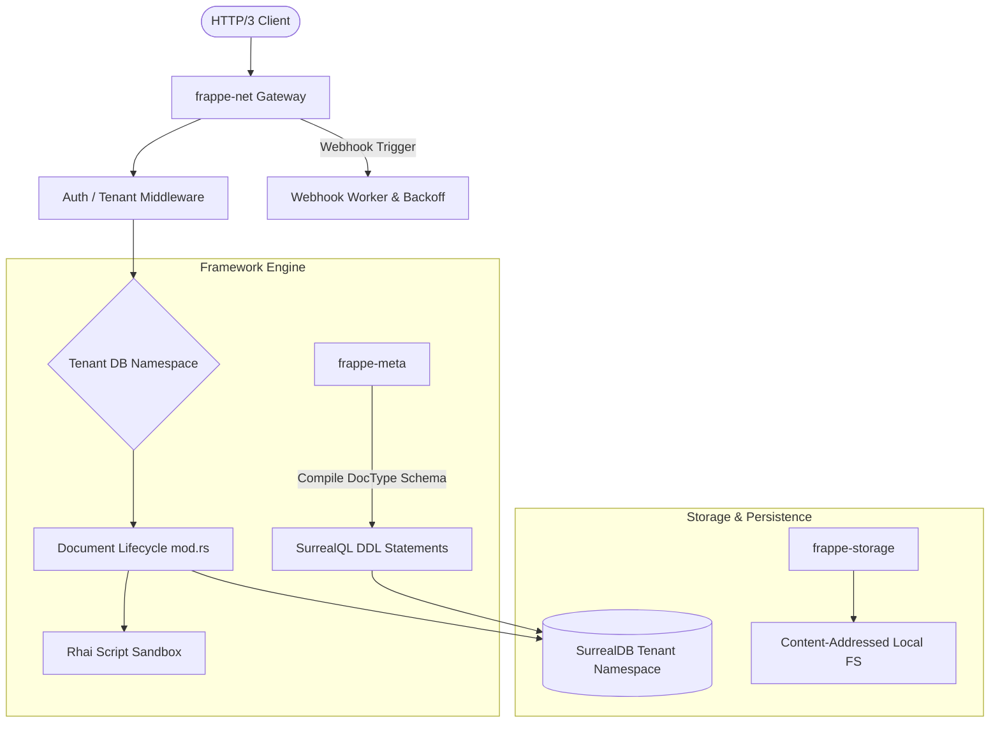

# Diagrams: frappe-framework

The diagram below maps the interaction from network requests, authentication/tenant mapping, and metadata schema compilation to final SurrealDB queries:

```mermaid
graph TD
    Client([HTTP/3 Client]) --> Net[frappe-net Gateway]
    Net --> Auth[Auth / Tenant Middleware]
    Auth --> Routing{Tenant DB Namespace}

    subgraph Framework Engine
        Routing --> Lifecycle[Document Lifecycle mod.rs]
        Lifecycle --> Scripting[Rhai Script Sandbox]
        
        Meta[frappe-meta] -->|Compile DocType Schema| DDL[SurrealQL DDL Statements]
    end

    subgraph Storage & Persistence
        Lifecycle --> DB[(SurrealDB Tenant Namespace)]
        DDL --> DB
        Storage[frappe-storage] --> FS[Content-Addressed Local FS]
    end

    Net -->|Webhook Trigger| WebhookWorker[Webhook Worker & Backoff]
```
