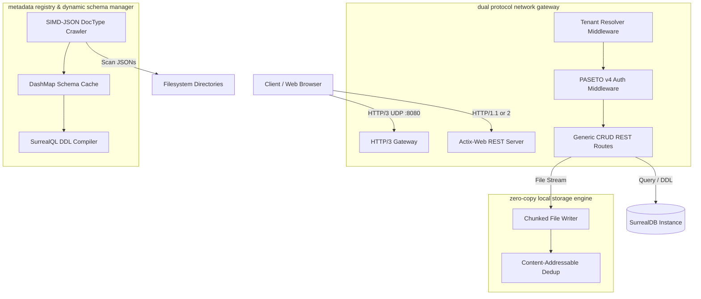

# Frappe Framework Core (Rust Edition)

This workspace contains the operational compiled core runtime engine for the refactored, high-performance ERPNext architecture built in Rust. It delivers low-latency dual-protocol networking, metadata registry schemas, and a zero-copy local storage layer.

## Architecture

---

## Workspace Crates

### 1. `frappe-net`
Provides the network gateway infrastructure supporting both stateless HTTP/3 and Actix-Web routing:
- **QUIC / HTTP/3 Gateway (`h3_server.rs`)**: Uses `quiche` (v0.29) configured with TLS 1.3 to run a UDP socket listener. Maintains persistent client connections and polls H3 frames in non-blocking event loops.
- **Tenant Resolver Middleware (`tenant.rs`)**: Parses `Host` headers in $O(1)$ complexity, sanitizes the name to database-compliant namespace format, and injects `TenantContext` downstream.
- **PASETO v4 Auth Middleware (`auth.rs`)**: Decrypts and validates modern `.local` v4 PASETO symmetric tokens securely, verifying user IDs, roles, and asserting client scopes.
- **CRUD Routes (`routes.rs`)**: Integrates with SurrealDB. Connects to tenant-specific databases to execute document create, read, update, and delete actions.

### 2. `frappe-meta`
Handles high-performance metadata parsing and translation to SurrealDB schemas:
- **SIMD-JSON Schema Crawler (`registry.rs`)**: Traverses app folders asynchronously in parallel, reads schema definition files, and parses JSON byte blocks using `simd-json` into memory caches.
- **Dynamic Schema Compiler (`schema.rs`)**: Formulates raw SurrealQL `DEFINE FIELD` and `DEFINE TABLE` DDL queries from parsed schema metadata on-the-fly.

### 3. `frappe-storage`
A zero-copy, non-blocking local storage utility (`local_fs.rs`) that streams byte streams, updates a SHA-256 hash in a single pass, and implements path boundary controls to block directories breakouts. Files are indexed using content hashes to prevent duplicate storage.

---

## Tech Stack & Dependencies

- **Tokio 1.52.3**: Multi-threaded async runtime.
- **Actix-Web 4.13.0**: REST endpoint middleware pipeline.
- **Quiche 0.29.0**: QUIC & HTTP/3 packet gateway implementation.
- **Pasetors 0.7.8**: Stateless PASETO token creation and verification.
- **Simd-JSON 0.14**: Highly optimized JSON parser utilizing SIMD instructions.
- **SurrealDB 3.0.5**: Multi-model tenant-isolated database connectivity.
